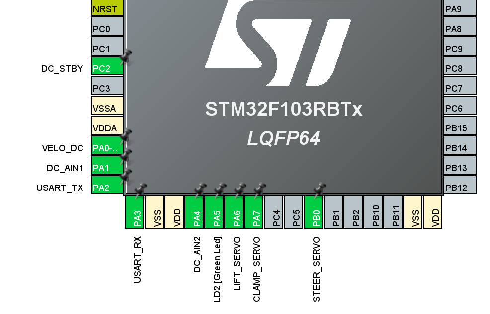
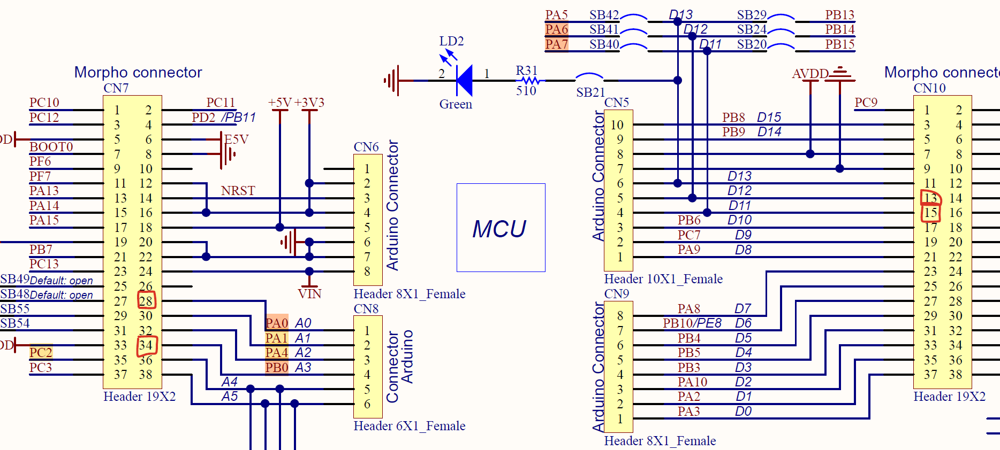

# **STM32 Firmware**

**NUCLEO-F103RB**

- 개요
- Hardware & CubeIDE(.ioc) 설정
- UART 패킷 명세
- 펌웨어 아키텍처
- FreeRTOS
    - Tasks & Priority
    - Priority
    - 주기
    - 동기화
- Drivers(motor/steer/dock)
- Safety (Timeout/Enable/E-stop latch)
- 동작 시나리오(정상주행/도킹/해제/통신끊김)
- 테스트 방법 & 디버깅 포인트
- 개선 방안


---

# 개요

### 역할

- 상위 보드(Jetson orin nano)에서 오는 **속도/조향/도킹 플래그 명령**을 UART로 수신
- STM32는 최종 안전권한(Safety Stop)을 가지고,
    - 조건 위반(Enable 꺼짐 / 통신 타임아웃 / ESTOP) 시 즉시 모터 정지 + 서보 Safe Pose
- DC 모터(PWM+DIR), 조향 서보(50Hz PWM), 도킹 서보 2개(50Hz PWM) 구동

### 핵심 원칙

- **안전 우선** → 달려도 되는 상태(run_ok)가 아니면 무조건 0 출력
- 상위가 뻗거나 통신이 끊겨도 STM32 단에서 **200ms Timeout** 시 즉시 정지하도록

# Hardware & CubeIDE(.ioc) 설정

## Pin/Peripheral Map

- .ioc
    
    
    
- Schematic
    
    
    

**UART:** USART2 사용 (RX 인터럽트 기반 수신)

### **DC 모터 (20kHz)**

- PWM: `TIM2_CH1` (PA0)
- DIR: `DC_AIN1`, `DC_AIN2` (PA1, PA4 - GPIO Output - PullDown)
- STBY(Enable): `DC_STBY` (PC2 - GPIO Output - PullDown)

### **서보 (50Hz)**

- 도킹 LIFT: `TIM3_CH1` (PA6)
- 도킹 CLAMP: `TIM3_CH2` (PA7)
- 조향 STEER: `TIM3_CH3` (PB0)

## 타이머

### TIM3 (서보 50Hz)

**20ms 주기(50Hz)**

- 기준은 마이크로초(us)
    
    서보가 Pulse를 보통
    
    - 1000us ~ 2000us
    - 주기 20000us(=20ms)
    
    이렇게 us 단위로 생각해서 1us를 Tick으로 맞춤
    

현재 SysTick은 64MHz

- prescaler 설정
    1. **1us tick 만들기**
    - 1MHz(=1us) 타이머
    - 공식: `TimerTick = TimerClk / (PSC+1)`
    - 64MHz에서 1MHz로 만들려면:
        - PSC = 64 - 1 = 63
    
    **Prescaler = 63 → 1MHz tick (1tick = 1us)**
    
    1. **20ms 주기 만들기**
    - 1us tick이니까 20ms = 20,000us
    - **Counter Period = 20000 - 1**
    
    1. **펄스 폭**
    - **CCR = 1500** → 1.5ms (서보 중앙 정렬)
    - 1000us(좌) ~ 2000us(우)

- Prescaler = 64-1 → 1MHz tick (1tick=1us)
- Counter Period = 20000-1 → 20,000us = 20ms
- CCR=1500이면 1.5ms 펄스


### TIM2 (DC모터 PWM)

Counter Period를 기준으로 duty 계산해서 CCR 넣는 구조

- PWM에서 CCR 설정
    
    **타이머 동작 방식**
    
    - 카운터가 `0 → 1 → 2 → ... → ARR` 까지 올라감
    - counter period 에 도달하면 다시 0으로 리셋됨 (이게 한 주기)
    
    PWM 출력의 결정
    
    - **카운터 값 < CCR** 이면 HIGH
    - **카운터 값 ≥ CCR** 이면 LOW
    
    CCR: HIGH로 유지되는 카운터값의 개수
    
    - Duty(%) = **CCR / (ARR+1)** × 100

```jsx
PWM_Freq = TimerClk / ((PSC+1) * (ARR+1))

예시(72MHz에서 20kHz):
- PSC=0, ARR=3599 → 72MHz / 3600 = 20kHz (해상도도 좋음)
```

**속도 조절**

원하는 duty가 30%라면

```
CCR = (Counter Period + 1) * 0.30
```

---

# UART 패킷 명세

## 패킷 형식

- Byte0: `0xAA` (MAGIC0)
- Byte1: `0x55` (MAGIC1)
- Byte2: `SEQ` (0~255 순번)
- Byte3: `FLAGS`
- Byte4: `SPEED` (int8, -100~100 권장)
- Byte5: `STEER` (int8, -100~100 권장)
- Byte6-7: `CRC16(IBM/MODBUS)` of byte0~5
    - init=0xFFFF, poly=0xA001
    - 수신 측은 little/big 둘 다 허용

### FLAGS 비트

- bit0: ENABLE (0x01)
- bit1: ESTOP (0x02) → 수신 시 estop_latched=1
- bit2: DOCK_START (0x04)
- bit3: DOCK_ABORT (0x08)

### CRC 규칙

- `crc16_ibm(pkt, 6)` 결과를 pkt[6], pkt[7]에 넣음
- STM32는 `crc_rx_le` / `crc_rx_be` 둘 다 비교해서 통과 처리

---

# 펌웨어 아키텍처

## 파일 구조

**shared state**

- `app_shared.h/.c`
    - 전역 상태(마지막 명령 시각, estop latch, safe stop, 최신 cmd, 출력값, rx flags)

**protocol**

- `cmd.h/.c`
    - 패킷 validate, CRC16, pkt → Cmd 구조체 변환

**tasks**

- `uartRxTask.c` : UART RX ISR + 링버퍼 + 패킷 파싱 + queue push
- `controlTask.c`: run_ok면 모터/조향 적용, 아니면 0 출력
- `safetyTask.c`: 최우선 안전 감시(Enable/Timeout/Estop)
- `dockTask.c` : DOCK_START/ABORT edge 기반 시퀀스 실행

**drivers**

- `motor.c` : TIM2 PWM + AIN1/AIN2 + STBY
- `steer_servo.c` : TIM3_CH3, -100~100 → 1000~2000us 매핑
- `dock.c` : TIM3_CH1/2, 도킹 시퀀스(내려가기-닫기-올리기 / 내려가기-열기-올리기)

---

# FreeRTOS

## Tasks & Priority

- **SafetyTask: osPriorityHigh** (주기 10ms)
- **ControlTask: osPriorityAboveNormal** (주기 20ms)
- **DockTask: osPriorityNormal** (주기 10ms 루프)
- **UartRxTask: osPriorityBelowNormal** (이벤트 기반)

### Priority 설계 기준

- **Safety는 항상 최우선**: 통신끊김/disable/estop 상태에서 출력이 절대 나가면 안 됨
- **Control은 출력 적용 루프**: 최신 cmd만 따라가면 되므로 50Hz면 충분
- **UART 수신은 ISR로 실시간**: 태스크 우선순위가 낮아도, 인터럽트가 바이트를 잃지 않게 링버퍼로 받음
- **Dock**: Control/Safety와 분리해서 도킹 때문에 주행제어가 멈추는 상황 방지

## Message Queue

- `cmdQueue = osMessageQueueNew(1, sizeof(Cmd), NULL);`
    - 길이 1 = 최신 명령만을 듣고 차량 상태 업데이트
    - put 시 꽉 찼으면 하나 빼고 최신으로 overwrite (`queue_put_latest`)
- UART는 `osThreadFlagsSet(UartRxTaskHandle, UART_RX_FLAG)`로 깨움

---

# Drivers(motor/steer/dock)

### DC 모터 (`drivers/motor.c`)

- `DC_Motor_SetSpeedPercent(int8_t spd)`
    - spd==0 → duty=0, coast, STBY false
    - spd>0 → AIN1=1 AIN2=0 (전진), duty=spd
    - spd<0 → AIN1=0 AIN2=1 (후진), duty=-spd
- PWM duty는 Counter Period 기반으로 비율 계산해서 CCR 설정

### 조향 서보 (`drivers/steer_servo.c`)

- 입력: -100~100 (%)
- 변환: `pulse_us = 1500 + steer*5`
    - 100 → 1000us, 0 → 1500us, +100 → 2000us

### 도킹 (`drivers/dock.c`)

- SafePose: **Lift Up + Clamp Open**
- Dock 시퀀스:
    1. Lift Down (1s)
    2. Clamp Close (2s)
    3. Lift Up (1s)
- Release 시퀀스:
    1. Lift Down (1s)
    2. Clamp Open (2s)
    3. Lift Up (1s)
- abort checker:
    - dock_abort_check(): g_safe_stop이면 abort

---

# Safety (Timeout/Enable/E-stop latch)

정지 조건이 **절대 우선**

SafetyTask 기준 상태 분류:

- 0=OK
- 1=TIMEOUT: `now - last_cmd_tick > CMD_FRESH_MS(200ms)`
- 2=ESTOP: `estop_latched == 1`
- 3=DISABLED: `FLAG_ENABLE == 0`

정지 시 동작(HardStop):

- `g_safe_stop=1`
- 모터 duty 0 + STBY false
- 조향 0%
- 도킹 SafePose

`estop_latched`는 수신 시 1로 세팅되고, 코드상 자동 해제가 없음 (수정)

---

# 동작 시나리오

### 정상 주행

1. 송신 측이 20~50Hz로 패킷 연속 송신
2. FLAGS에 ENABLE=1 유지
3. ControlTask run_ok 조건 만족 시:
    - speed/steer 적용
4. 송신 끊기면 200ms 내 Safety가 HARD STOP

### 도킹 시작

- DOCK_START가 0→1 엣지로 들어오면 DockTask가 `Dock_RunDockSequence()`
- 안전상태(g_safe_stop)면 도킹 동작 안 하고 SafePose 유지

### 도킹 해제(Abort)

- DOCK_ABORT가 0→1 엣지로 들어오면 `Dock_RunReleaseSequence()`

---

# 개선 방안

- ESTOP latch 해제 프로토콜 추가(예: 별도 RESET 플래그 + 물리 버튼 병행)
- Dock 시퀀스 delay를 1000ms 통째로 기다리지 말고, 10~20ms 단위로 쪼개서 중간 abort 즉시 반영
- Speed/Steer에 slew-rate(변화율 제한) 옵션 추가(저속 안정성/기구 보호)
- Telemetry(상위로 상태/에러코드/현재 출력값) 송신 추가하면 운영성이 확 올라감
